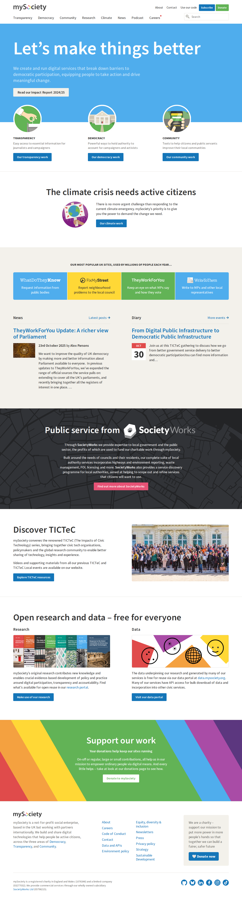
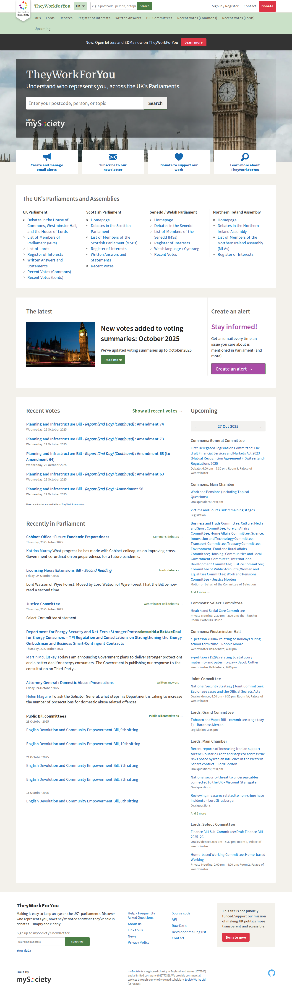
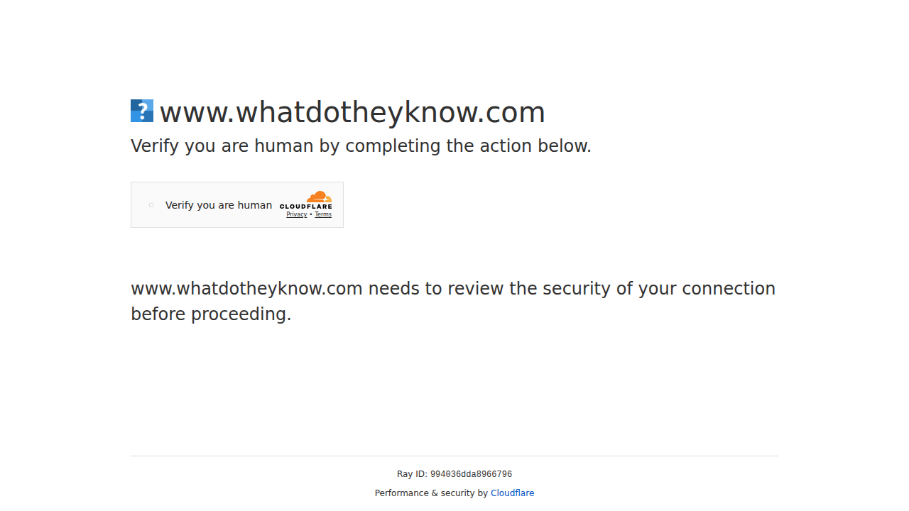
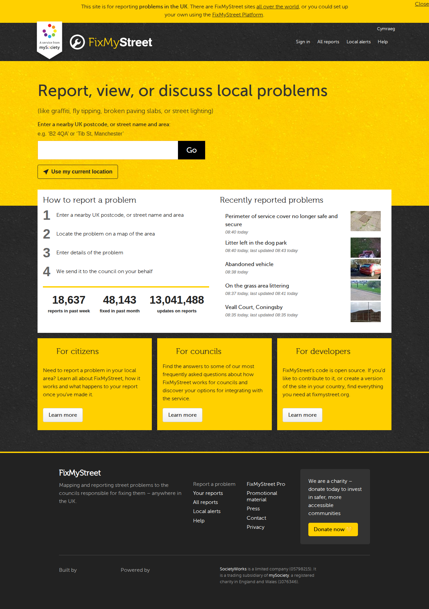
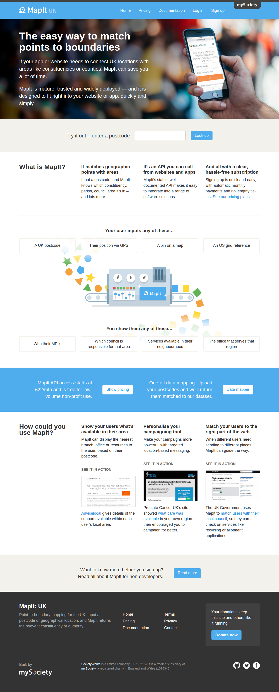
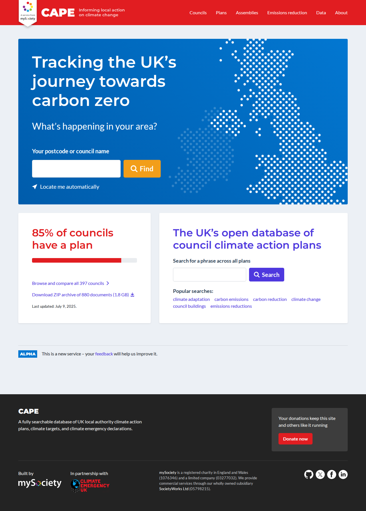
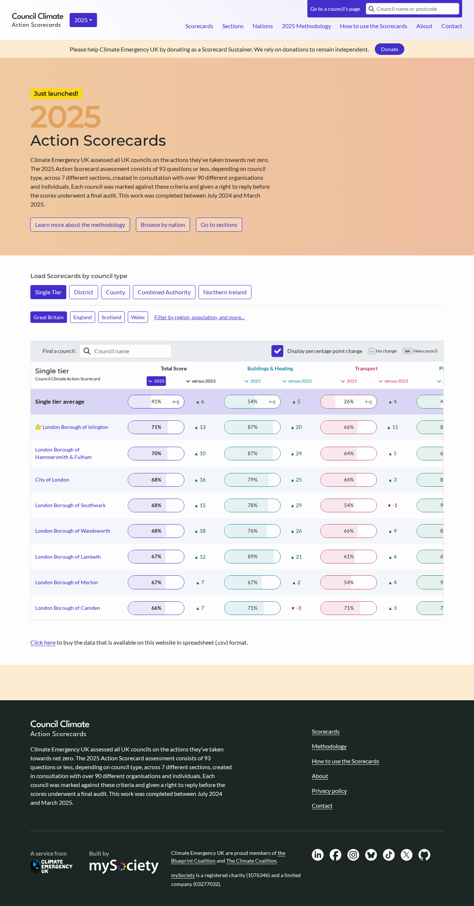
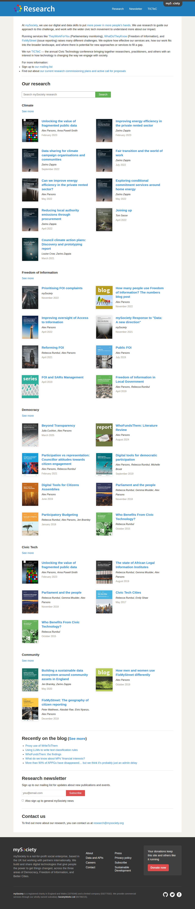
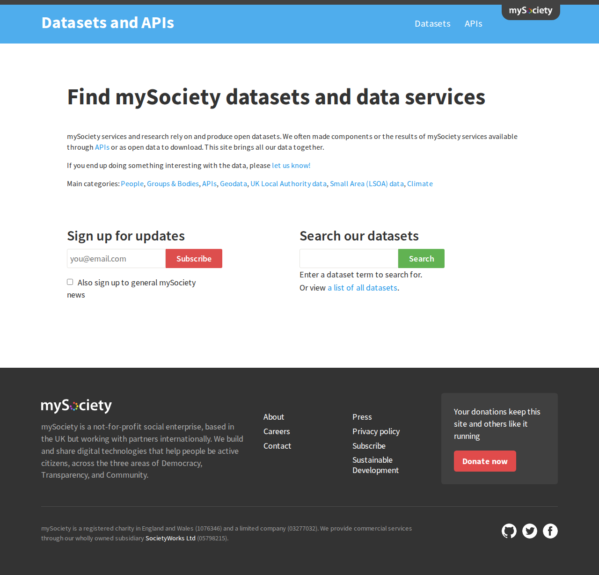

# Service front pages

Last rendered on: 2024-03-07

# Index

## Climate
- [CAPE](#cape)
- [Council climate scorecards](#council-climate-scorecards)

## Community
- [FixMyStreet](#fixmystreet)
- [MapIt](#mapit)

## Democracy
- [TheyWorkForYou](#theyworkforyou)
- [WriteToThem](#writetothem)

## mySociety
- [mySociety Main page](#mysociety-main-page)
- [Research](#research)
- [Data](#data)

## Transparency
- [WhatDoTheyKnow](#whatdotheyknow)

# Front pages

## mySociety Main page

https://mysociety.org

### Desktop

## TheyWorkForYou

https://theyworkforyou.com/

### Desktop

## WriteToThem

https://www.writetothem.com/

### Desktop

## WhatDoTheyKnow

https://www.whatdotheyknow.com/

### Desktop

## FixMyStreet

https://www.fixmystreet.com/

### Desktop

## MapIt

https://mapit.mysociety.org/

### Desktop

## CAPE

https://data.climateemergency.uk/

### Desktop

## Council climate scorecards

https://councilclimatescorecards.uk/

### Desktop

## Research

https://research.mysociety.org/

### Desktop

## Data

https://data.mysociety.org/

### Desktop

